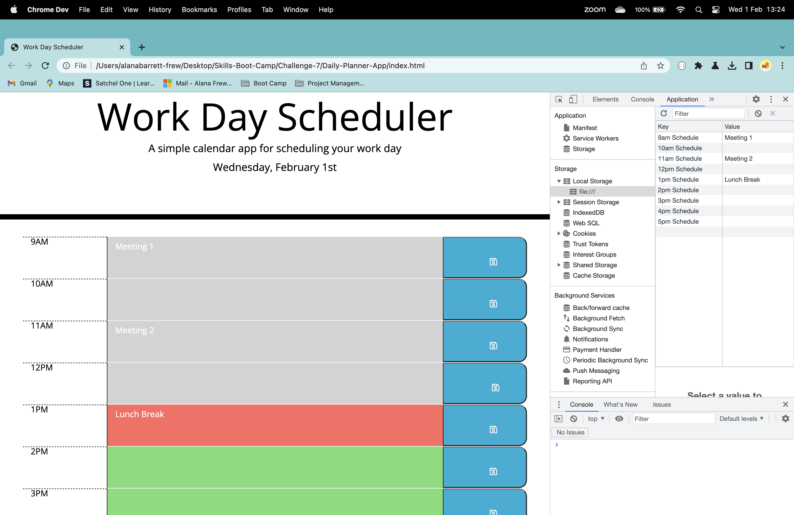

# Daily-Planner-App
A simple calendar application that allows a user to save events for each hour of the day.

## Overview

 An application that allows a user to save events for each hour of the day by modifying starter code. This app runs in the browser and features dynamically updated HTML and CSS powered by jQuery. The [Moment.js](http://momentjs.com/) library is used to work with date and time.

 https://alanabf.github.io/Daily-Planner-App/ 

## User Story

```md
AS AN employee with a busy schedule
I WANT to add important events to a daily planner
SO THAT I can manage my time effectively
```

## Functionality

The app: 

* Displays the current day at the top of the calender when a user opens the planner.
 
* Presents timeblocks for standard business hours when the user scrolls down.
 
* Color-codes each timeblock based on past, present, and future when the timeblock is viewed.
 
* Allows a user to enter an event when they click a timeblock

* Saves the event in local storage when the save button is clicked in that timeblock.

* Persists events between refreshes of a page

## Installation

This application runs in the browser. 

## Usage

 

## Technology Used

* JavaScript
* jQuery
* Moment.js
* The DOM
* CSS and html files.

## Credits

N/A

## License

MIT

---